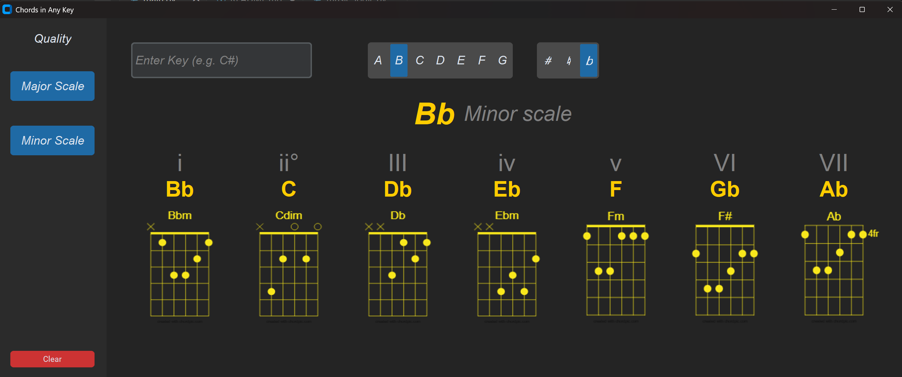

# 🎸 Guitar Chords & Scales App

A desktop application built with Python and CustomTkinter that helps guitarists visualize musical scales and their corresponding chord shapes across any key.

## 🌟 Key Features

- **Dynamic Scale Generation:** Supports both Major and Minor scales in every key (including sharps and flats).
- **Correct Enharmonic Spelling:** Uses a custom algorithm to ensure notes are spelled correctly according to music theory.
- **Visual Chord Diagrams:** Automatically displays guitar chord shapes for every degree of the chosen scale.
- **Modern UI:** Built with a responsive, dark-mode interface using `CustomTkinter`.

## 🛠️ Technical Highlights

This being my first public project I tried to focuse on "clean code" principles during this project:

*   **DRY (Don't Repeat Yourself):** Refactored the scale generation logic into a single, dynamic function that handles multiple modes.
*   **Separation of Concerns:** Split the project into `main.py` (UI/UX) and `music_logic.py` (Music Theory Math) to keep the codebase maintainable.
*   **Robust Asset Loading:** Implemented a fallback mechanism for missing images and used absolute pathing to ensure the app is portable across different systems.
*   **Object-Oriented Programming (OOP):** Utilized Python classes to manage the application state and UI lifecycle.

## 🚀 How to Run

Download the latest release from GitHub and run the .exe file.

## Changelog

### - 2026-02-24
**Added**
- New interactive buttons for musical Keys (A-G).
- Buttons for Sharps (#) and Flats (b) to simplify input.
- Clear text input after loading the notes to not mess with the new button inputs
- Update screenshot of the new version

**Fixed**
- Minor UI alignment issues on the chord display screen.
- Few chord pictures updated.
- clear button not clearing the screen
- Bigger fonts, bigger user input box and bigger buttons
---

### - 2026-02-23
**Added**
- Initial release of the Guitar Chords and Scales app.
- Support for manual text input of chord names.
- Display of corresponding scales and finger position images.